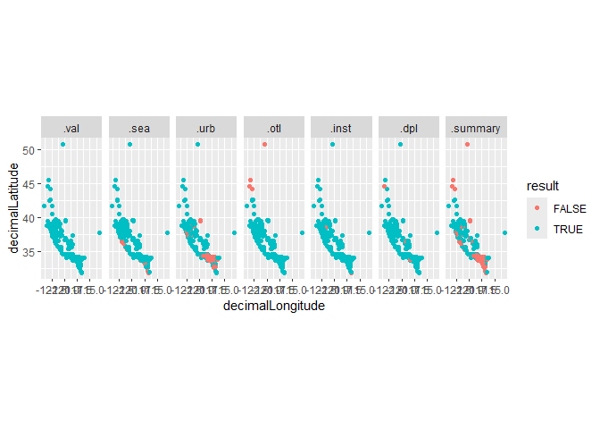
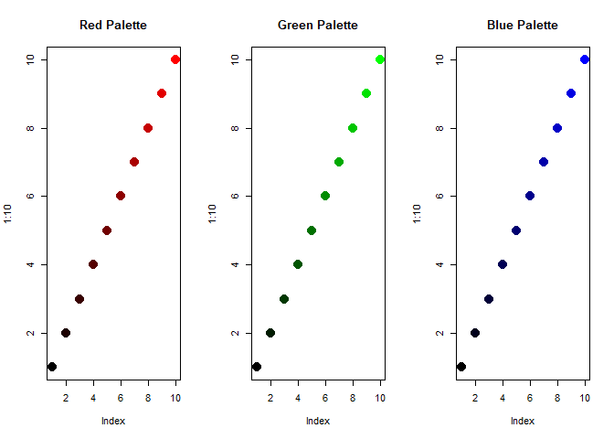

Functional coding in R
================
Anusha Bishop

- [1. Functionals](#1-functionals)
- [2. Functional factories](#2-functional-factories)
- [3. Function operators](#3-function-operators)
- [Try it out!](#try-it-out)
- [A word of caution](#a-word-of-caution)

This tutorial will cover the basics of functional programming in R using
the purrr package. In functional-style programming, we can break big
problems into smaller pieces, and then solve each piece with a function.
This is a powerful way to write code because it is more modular, easier
to read, and less error-prone. This material is based off of Hadley
Wicham’s Advanced R book, which is a great resource for learning more
about functional programming in R (<https://adv-r.hadley.nz/>).

Let’s start by installing and loading the libraries we will need for
this tutorial:

``` r
install_and_load <- function(package) {
  if (!require(package, character.only = TRUE)) {
    install.packages(package, dependencies = TRUE)
  }
  library(package, character.only = TRUE)
  return()
}

packages <- c("purrr", "CoordinateCleaner", "dplyr", "tidyr", "rgbif", "ggplot2")
lapply(packages, install_and_load) # Will return NULL if successful
```

    ## Loading required package: purrr

    ## Loading required package: CoordinateCleaner

    ## Warning: package 'CoordinateCleaner' was built under R version 4.3.3

    ## Loading required package: dplyr

    ## Warning: package 'dplyr' was built under R version 4.3.2

    ## 
    ## Attaching package: 'dplyr'

    ## The following objects are masked from 'package:stats':
    ## 
    ##     filter, lag

    ## The following objects are masked from 'package:base':
    ## 
    ##     intersect, setdiff, setequal, union

    ## Loading required package: tidyr

    ## Warning: package 'tidyr' was built under R version 4.3.2

    ## Loading required package: rgbif

    ## Warning: package 'rgbif' was built under R version 4.3.3

    ## Loading required package: ggplot2

    ## Warning: package 'ggplot2' was built under R version 4.3.3

    ## [[1]]
    ## NULL
    ## 
    ## [[2]]
    ## NULL
    ## 
    ## [[3]]
    ## NULL
    ## 
    ## [[4]]
    ## NULL
    ## 
    ## [[5]]
    ## NULL
    ## 
    ## [[6]]
    ## NULL

# 1. Functionals

The first concept we will cover is functionals. Functionals are
functions that take a function as an input and return a vector (or list)
as output.

Examples: `lapply()`, `apply()`, `tapply()`, or `purrr::map()`

Functionals are commonly used as an alternative to for loops. For loops
aren’t bad, but they are often “too flexible” (unclear what you are
producing, potential side effects, not input/output oriented, etc.)

We will be using the purrr package to work with functionals. Purrr
provides a consistent and user friendly set of tools for working with
functions. The most basic purrr function is `map()`. This function takes
a vector or list as input and applies a function to each element. The
output is a list where each element is the result of applying the
function to the corresponding element of the input.

``` r
# here is a simple example of using map to print each element of a vector
map(c("hi", "hello", "yoohoo"), function(greeting) print(greeting))
```

    ## [1] "hi"
    ## [1] "hello"
    ## [1] "yoohoo"

    ## [[1]]
    ## [1] "hi"
    ## 
    ## [[2]]
    ## [1] "hello"
    ## 
    ## [[3]]
    ## [1] "yoohoo"

``` r
# you can also use the shorthand ~ to define a function
map(c("hi", "hello", "yoohoo"), ~print(.x))
```

    ## [1] "hi"
    ## [1] "hello"
    ## [1] "yoohoo"

    ## [[1]]
    ## [1] "hi"
    ## 
    ## [[2]]
    ## [1] "hello"
    ## 
    ## [[3]]
    ## [1] "yoohoo"

``` r
# or you can use an existing function, if there is only one argument
map(c("hi", "hello", "yoohoo"), print)
```

    ## [1] "hi"
    ## [1] "hello"
    ## [1] "yoohoo"

    ## [[1]]
    ## [1] "hi"
    ## 
    ## [[2]]
    ## [1] "hello"
    ## 
    ## [[3]]
    ## [1] "yoohoo"

How is this different from a non-functional? Let’s say you wanted to
simulate rolling a standard die (d6), a d10, and a magic 8 ball 10
times. You could use a for loop to do this:

``` r
die <- c(d6 = 6, d10 = 10, magic8ball = 20)

roll_results <- list()

for (i in 1:length(die)) {
  roll_results[[i]] <- sample(1:die[i], 10, replace = TRUE)
}

names(roll_results) <- names(die)

roll_results
```

    ## $d6
    ##  [1] 6 5 2 1 2 1 4 6 2 1
    ## 
    ## $d10
    ##  [1]  2  6  3  4  9 10  5 10  2 10
    ## 
    ## $magic8ball
    ##  [1] 14  4 16 20  3 13  1  7 18 14

Or you could define a function to roll a die given some number of sides
and then use map to run that function 10 times:

``` r
die <- c(d6 = 6, d10 = 10, magic8ball = 20)

roll <- function(sides) sample(1:sides, 10, replace = TRUE)

roll_results <- map(die, roll)

roll_results
```

    ## $d6
    ##  [1] 2 6 4 1 2 3 6 1 4 5
    ## 
    ## $d10
    ##  [1]  9 10  3  8  4  8  1 10  5  5
    ## 
    ## $magic8ball
    ##  [1]  9  3 14  7 14  7 18 14  8  8

Some benefits of this approach are: 1. It is easier to read and
understand. You define a function whose name tells you what it is doing
(`roll()`) and then apply that function to your list of die. 2. If there
happened to be a bug in the `roll()` function, we could fix it in one
place and it would be fixed for all the rolls. 3. You can easily modify
the function by adding additional arguments, such as the number of times
to roll the die. 4. We won’t have any side effects from the for loop,
such as accidentally overwriting a variable. 5. The output preserves the
names of the input vector, so we easily know which die each set of rolls
corresponds to without having to assign names to the output (which can
be risky in other contexts).

If you don’t like the tidyverse, you can also use `sapply()` or
`lapply()` to do the same thing:

``` r
sapply(1:10, function(x) roll(sides = 6))
```

    ##       [,1] [,2] [,3] [,4] [,5] [,6] [,7] [,8] [,9] [,10]
    ##  [1,]    1    1    3    6    6    1    4    1    3     3
    ##  [2,]    3    1    3    2    4    6    4    4    5     2
    ##  [3,]    3    4    3    1    2    6    4    1    1     1
    ##  [4,]    4    5    6    3    2    3    3    3    3     5
    ##  [5,]    5    4    2    1    2    1    1    3    4     6
    ##  [6,]    4    3    4    3    1    6    5    3    1     6
    ##  [7,]    2    5    3    5    1    3    6    4    1     4
    ##  [8,]    1    1    3    4    4    1    2    1    4     1
    ##  [9,]    2    6    1    5    2    6    4    5    1     5
    ## [10,]    4    3    3    4    4    6    5    4    3     1

**Example 1: Using `map()` to pull occurrence data for a list of
species**

Now let’s try applying `map()` to a more realistic research problem.
Imagine we have a list of species and we want to pull occurrence data
for each species from the GBIF database. We can use a functional
approach with the `map()` function to iterate over each species and pull
the data.

``` r
# First, let's define a list of species we want to pull occurrence data for
# Let's say we are working on three different projects and each project is focused on a different species
species <- 
  c(
    Project01 = "Sceloporus occidentalis", 
    Project02 = "Phrynosoma blainvillii", 
    Project03 = "Plestiodon skiltonianus"
  )

# Map over the species vector and use occ_search to pull occurrence data for each species
#  ~ .x is a shorthand for function(x) x
# .progress = TRUE will show a progress bar (super handy for the impatient, like me)
occ_records <- map(species, ~occ_search(scientificName = .x, hasCoordinate = TRUE, limit = 1000), .progress = TRUE)
```

    ## ■■■■■■■■■■■ 33% | ETA: 24s ■■■■■■■■■■■■■■■■■■■■■ 67% | ETA: 12s

``` r
# This will provide a list where each element is the occurrence data for a species
# For example, let's look at the Project01 element
# Note that the names of the list correspond to the names of the species vector 
occ_records[["Project01"]]
```

    ## Records found [135878] 
    ## Records returned [1000] 
    ## No. unique hierarchies [1] 
    ## No. media records [1000] 
    ## No. facets [0] 
    ## Args [hasCoordinate=TRUE, occurrenceStatus=PRESENT, limit=1000, offset=0,
    ##      scientificName=Sceloporus occidentalis, fields=all] 
    ## # A tibble: 1,000 × 95
    ##    key        scientificName  decimalLatitude decimalLongitude issues datasetKey
    ##    <chr>      <chr>                     <dbl>            <dbl> <chr>  <chr>     
    ##  1 5006703295 Sceloporus occ…            32.6            -117. cdc,c… 50c9509d-…
    ##  2 5006770293 Sceloporus occ…            34.1            -118. cdc,c… 50c9509d-…
    ##  3 5006775023 Sceloporus occ…            34.1            -118. cdc,c… 50c9509d-…
    ##  4 5006830074 Sceloporus occ…            38.7            -122. cdc,c… 50c9509d-…
    ##  5 5006926024 Sceloporus occ…            34.1            -118. cdc,c… 50c9509d-…
    ##  6 5006950619 Sceloporus occ…            34.3            -119. cdc,c… 50c9509d-…
    ##  7 5007283698 Sceloporus occ…            35.3            -121. cdc,c… 50c9509d-…
    ##  8 5007296532 Sceloporus occ…            34.1            -118. cdc,c… 50c9509d-…
    ##  9 5007298566 Sceloporus occ…            32.7            -117. cdc,c… 50c9509d-…
    ## 10 5007433971 Sceloporus occ…            34.0            -118. cdc,c… 50c9509d-…
    ## # ℹ 990 more rows
    ## # ℹ 89 more variables: publishingOrgKey <chr>, installationKey <chr>,
    ## #   hostingOrganizationKey <chr>, publishingCountry <chr>, protocol <chr>,
    ## #   lastCrawled <chr>, lastParsed <chr>, crawlId <int>, projectId <chr>,
    ## #   basisOfRecord <chr>, occurrenceStatus <chr>, taxonKey <int>,
    ## #   kingdomKey <int>, phylumKey <int>, classKey <int>, familyKey <int>,
    ## #   genusKey <int>, speciesKey <int>, acceptedTaxonKey <int>, …

``` r
# This element is an rgbif object
class(occ_records[["Project01"]])
```

    ## [1] "gbif"

``` r
# And therefore has several different elements itself
names(occ_records[["Project01"]])
```

    ## [1] "meta"      "hierarchy" "data"      "media"     "facets"

``` r
# What we care about is the "data" element, and we can use map to pull just that element out
occ_data <- map(occ_records, "data")

# We can also bind the rows of our list together to make a dataframe
# The .id argument will add a column with the name of the list element, in this case our original project ID (this is super handy for keeping track of where things come from in a list)
occ_df <- bind_rows(occ_data, .id = "project")
head(occ_df)
```

    ## # A tibble: 6 × 96
    ##   project   key        scientificName    decimalLatitude decimalLongitude issues
    ##   <chr>     <chr>      <chr>                       <dbl>            <dbl> <chr> 
    ## 1 Project01 5006703295 Sceloporus occid…            32.6            -117. cdc,c…
    ## 2 Project01 5006770293 Sceloporus occid…            34.1            -118. cdc,c…
    ## 3 Project01 5006775023 Sceloporus occid…            34.1            -118. cdc,c…
    ## 4 Project01 5006830074 Sceloporus occid…            38.7            -122. cdc,c…
    ## 5 Project01 5006926024 Sceloporus occid…            34.1            -118. cdc,c…
    ## 6 Project01 5006950619 Sceloporus occid…            34.3            -119. cdc,c…
    ## # ℹ 90 more variables: datasetKey <chr>, publishingOrgKey <chr>,
    ## #   installationKey <chr>, hostingOrganizationKey <chr>,
    ## #   publishingCountry <chr>, protocol <chr>, lastCrawled <chr>,
    ## #   lastParsed <chr>, crawlId <int>, projectId <chr>, basisOfRecord <chr>,
    ## #   occurrenceStatus <chr>, taxonKey <int>, kingdomKey <int>, phylumKey <int>,
    ## #   classKey <int>, familyKey <int>, genusKey <int>, speciesKey <int>,
    ## #   acceptedTaxonKey <int>, acceptedScientificName <chr>, kingdom <chr>, …

**Example 2: the wonders of `pmap()`**

Now let’s say you want to download occurrence records for specimens from
the MVZ, LACM, and CAS museums. You could do a nested for-loop to
iterate over each species and each museum…or you could use `pmap()`, a
function which will allow us to iterate over all of our combinations at
once.

``` r
museums <- c("MVZ", "LACM", "CAS")

# To make our code a little easier to read and put the "function" in functional, let's first make a function that will pull occurrence data for a species from a museum
occ_search_museum <- function(species, museum) {
  occ_search(
    scientificName = species, 
    hasCoordinate = TRUE, 
    limit = 1000,
    basisOfRecord = "PRESERVED_SPECIMEN",
    institutionCode = museum
  )$data
} 

# Now, lets create grid of all the combinations of species and museums
# This will be a dataframe with two columns, one for species and one for museum with all possible combinations of the two 
species_museum <- expand_grid(speciesID = species, museumID = museums)
print(species_museum)
```

    ## # A tibble: 9 × 2
    ##   speciesID               museumID
    ##   <chr>                   <chr>   
    ## 1 Sceloporus occidentalis MVZ     
    ## 2 Sceloporus occidentalis LACM    
    ## 3 Sceloporus occidentalis CAS     
    ## 4 Phrynosoma blainvillii  MVZ     
    ## 5 Phrynosoma blainvillii  LACM    
    ## 6 Phrynosoma blainvillii  CAS     
    ## 7 Plestiodon skiltonianus MVZ     
    ## 8 Plestiodon skiltonianus LACM    
    ## 9 Plestiodon skiltonianus CAS

``` r
# Instead of map() we will now use pmap(), which will take each row of species_museum to fill in the arguments of occ_search_museum()
# Notice that we use \(x, y) to define the arguments of the function, this is the same thing as ~function(x, y), but in a more concise format
museum_records <- 
  pmap(species_museum, \(speciesID, museumID) occ_search_museum(species = speciesID, museum = museumID), .progress = TRUE) %>%
  bind_rows()
```

    ## ■■■■ 11% | ETA: 2m ■■■■■■■■ 22% | ETA: 2m ■■■■■■■■■■■ 33% | ETA: 1m
    ## ■■■■■■■■■■■■■■ 44% | ETA: 1m ■■■■■■■■■■■■■■■■■■ 56% | ETA: 34s
    ## ■■■■■■■■■■■■■■■■■■■■■ 67% | ETA: 23s ■■■■■■■■■■■■■■■■■■■■■■■■ 78% | ETA: 17s
    ## ■■■■■■■■■■■■■■■■■■■■■■■■■■■■ 89% | ETA: 8s

``` r
# We could have also used pmap(species_museum, occ_search_museum) since our arguments are in order, but this way is a little more explicit and less prone to bugs
```

# 2. Functional factories

Another key concept in functional programming is functional factories.
Functional factories are functions that return other functions. This can
be useful if you have a lot of different functions that all need to use
the same arguments.

**Example 3: creating a museum factory**

Below we use a factory function to create functions that will pull
occurrence data from a specific museum.

``` r
museum_factory <- function(museum){
  occ_search_museum <- function(species) {
    result <- occ_search(
      scientificName = species, 
      hasCoordinate = TRUE, 
      limit = 1000,
      basisOfRecord = "PRESERVED_SPECIMEN",
      institutionCode = museum
    )$data
  }
}

# We can use our factory to create functions that will pull occurrence data for a species from a specific museum
search_mvz <- museum_factory("MVZ")
search_lacm <- museum_factory("LACM")
search_cas <- museum_factory("CAS")

# We can use our new functions to pull occurrence data from a specific museum
search_mvz("Crotalus cerastes")
```

# 3. Function operators

Our final functional programming technique is the use of function
operators. Function operators are functions that take other functions as
input and return a new function as output. In other words, they are just
function factories that take a function as input. Function operators can
be particularly useful for error handling, as you will see in the next
example.

**Example 4: catching errors with safely() and possibly()**

Have you ever been runnning a super long loop and then it fails 90% of
the way through? Argh! Wouldn’t it be better if it stored the results of
everything that worked and then told you what went wrong? Well, that is
what `safely()` does! `safely()` will take in your function and return a
new function that will return a list with the result of the function if
it works or an error message if the function fails.

``` r
# Let's imagine we have an invalid species name in our list
species <- 
  c(
    Project01 = "Phrynosoma blainvillii", 
    Project02 = "Plestiodon skiltonianus",
    Project03 = "Bogus bogus"
  )

# We won't initially get an error from our search function because the function will just return a NULL
mvz_specimens <- map(species, search_mvz, .progress = TRUE)
```

    ## ■■■■■■■■■■■■■■■■■■■■■ 67% | ETA: 6s

``` r
# But if we try do stuff with the list, such as pull coordinates out, we will get an error
pull_coords <- function(data){
  data <- dplyr::select(data, species, decimalLatitude, decimalLongitude)
  return(data)
}
# map(mvz_specimens, pull_coords) # this will fail!

# We can use safely() to create a new function that will catch any errors
safe_function <- safely(pull_coords)
coords <- map(mvz_specimens, safe_function)

# If we look at the output, we will see that the output is a list with two elements, result and error
coords[["Project01"]]
```

    ## $result
    ## # A tibble: 1 × 3
    ##   species                decimalLatitude decimalLongitude
    ##   <chr>                            <dbl>            <dbl>
    ## 1 Phrynosoma blainvillii            36.7            -122.
    ## 
    ## $error
    ## NULL

``` r
# If the function was successful , the result element will contain the output of the function and the error element will be NULL
coords[["Project01"]]$result
```

    ## # A tibble: 1 × 3
    ##   species                decimalLatitude decimalLongitude
    ##   <chr>                            <dbl>            <dbl>
    ## 1 Phrynosoma blainvillii            36.7            -122.

``` r
coords[["Project01"]]$error
```

    ## NULL

``` r
# If the function failed, the result element will be NULL and the error element will contain the error message
coords[["Project03"]]$result
```

    ## NULL

``` r
coords[["Project03"]]$error
```

    ## <simpleError in UseMethod("select"): no applicable method for 'select' applied to an object of class "NULL">

``` r
# You can use map() to pull out the error messages
map(coords, "error")
```

    ## $Project01
    ## NULL
    ## 
    ## $Project02
    ## NULL
    ## 
    ## $Project03
    ## <simpleError in UseMethod("select"): no applicable method for 'select' applied to an object of class "NULL">

``` r
# You can also use map to pull out the elements with no errors and compact() to remove any NULL elements
coords <- map(coords, "result") %>% compact()
```

Another handy function operator is `possibly()`. This will return a list
with the result or NULL if the function failed. This can be useful if
you know that some of your functions will fail, but you just want to
ignore them and keep going and then drop them later.

``` r
# Possible_function will return NULL if the function fails
# You can change the otherwise argument to return something else (e.g., NA or "No result"), if you want
possible_function <- possibly(pull_coords, otherwise = NULL)

# Now we can use possible_function() to pull out the coordinates and ignore any errors
coords <- map(mvz_specimens, possible_function)

# And then we can use compact() to remove any NULL elements
coords <- compact(coords)
```

# Try it out!

Now it’s time for you to be functional! The following code uses the
CoordinateCleaner package to clean up some occurrence data using the
`clean_coordinates()`function; this function takes in a dataframe of
occurrence data and a list of tests to run. The output is a dataframe
with a column for each test that was run and a flag for each record that
failed that test. Rewrite the code in a functional programming style
using the purrr functions we have learned about:

``` r
library(CoordinateCleaner)

clean_project1 <- clean_coordinates(occ_data[["Project01"]], tests = c("institutions", "seas", "duplicates", "outliers", "urban"))
```

    ## Testing coordinate validity

    ## Flagged 0 records.

    ## Testing sea coordinates

    ## Reading layer `ne_50m_land' from data source 
    ##   `C:\Users\Anusha\AppData\Local\Temp\RtmpsVmAIy\ne_50m_land.shp' 
    ##   using driver `ESRI Shapefile'
    ## Simple feature collection with 1420 features and 3 fields
    ## Geometry type: MULTIPOLYGON
    ## Dimension:     XY
    ## Bounding box:  xmin: -180 ymin: -89.99893 xmax: 180 ymax: 83.59961
    ## Geodetic CRS:  WGS 84

    ## Flagged 29 records.

    ## Testing urban areas

    ## Downloading urban areas via rnaturalearth

    ## Reading layer `ne_50m_urban_areas' from data source 
    ##   `C:\Users\Anusha\AppData\Local\Temp\RtmpsVmAIy\ne_50m_urban_areas.shp' 
    ##   using driver `ESRI Shapefile'
    ## Simple feature collection with 2143 features and 4 fields
    ## Geometry type: POLYGON
    ## Dimension:     XY
    ## Bounding box:  xmin: -157.984 ymin: -46.26844 xmax: 174.97 ymax: 69.35127
    ## Geodetic CRS:  WGS 84

    ## Flagged 590 records.

    ## Testing geographic outliers

    ## Flagged 6 records.

    ## Testing biodiversity institutions

    ## Flagged 27 records.

    ## Testing duplicates

    ## Flagged 24 records.

    ## Flagged 631 of 1000 records, EQ = 0.63.

``` r
clean_project2 <- clean_coordinates(occ_data[["Project02"]], tests = c("institutions", "outliers", "seas", "duplicates", "urban"))
```

    ## Testing coordinate validity

    ## Flagged 0 records.

    ## Testing sea coordinates

    ## Reading layer `ne_50m_land' from data source 
    ##   `C:\Users\Anusha\AppData\Local\Temp\RtmpsVmAIy\ne_50m_land.shp' 
    ##   using driver `ESRI Shapefile'
    ## Simple feature collection with 1420 features and 3 fields
    ## Geometry type: MULTIPOLYGON
    ## Dimension:     XY
    ## Bounding box:  xmin: -180 ymin: -89.99893 xmax: 180 ymax: 83.59961
    ## Geodetic CRS:  WGS 84

    ## Flagged 33 records.

    ## Testing urban areas

    ## Downloading urban areas via rnaturalearth

    ## Reading layer `ne_50m_urban_areas' from data source 
    ##   `C:\Users\Anusha\AppData\Local\Temp\RtmpsVmAIy\ne_50m_urban_areas.shp' 
    ##   using driver `ESRI Shapefile'
    ## Simple feature collection with 2143 features and 4 fields
    ## Geometry type: POLYGON
    ## Dimension:     XY
    ## Bounding box:  xmin: -157.984 ymin: -46.26844 xmax: 174.97 ymax: 69.35127
    ## Geodetic CRS:  WGS 84

    ## Flagged 127 records.

    ## Testing geographic outliers

    ## Flagged 0 records.

    ## Testing biodiversity institutions

    ## Flagged 1 records.

    ## Testing duplicates

    ## Flagged 7 records.

    ## Flagged 167 of 1000 records, EQ = 0.17.

``` r
clean_project3 <- clean_coordinates(occ_data[["Project03"]], tests = c("institutions", "outliers", "seas", "duplicates", "urban"))
```

    ## Testing coordinate validity

    ## Flagged 0 records.

    ## Testing sea coordinates

    ## Reading layer `ne_50m_land' from data source 
    ##   `C:\Users\Anusha\AppData\Local\Temp\RtmpsVmAIy\ne_50m_land.shp' 
    ##   using driver `ESRI Shapefile'
    ## Simple feature collection with 1420 features and 3 fields
    ## Geometry type: MULTIPOLYGON
    ## Dimension:     XY
    ## Bounding box:  xmin: -180 ymin: -89.99893 xmax: 180 ymax: 83.59961
    ## Geodetic CRS:  WGS 84

    ## Flagged 44 records.

    ## Testing urban areas

    ## Downloading urban areas via rnaturalearth

    ## Reading layer `ne_50m_urban_areas' from data source 
    ##   `C:\Users\Anusha\AppData\Local\Temp\RtmpsVmAIy\ne_50m_urban_areas.shp' 
    ##   using driver `ESRI Shapefile'
    ## Simple feature collection with 2143 features and 4 fields
    ## Geometry type: POLYGON
    ## Dimension:     XY
    ## Bounding box:  xmin: -157.984 ymin: -46.26844 xmax: 174.97 ymax: 69.35127
    ## Geodetic CRS:  WGS 84

    ## Flagged 223 records.

    ## Testing geographic outliers

    ## Flagged 0 records.

    ## Testing biodiversity institutions

    ## Flagged 1 records.

    ## Testing duplicates

    ## Flagged 12 records.

    ## Flagged 280 of 1000 records, EQ = 0.28.

``` r
clean_list <- list(Project01 = clean_project1, Project02 = clean_project2, Project03 = clean_project3)
```

The tests argument specifies which tests to run. The tests specified
here are: - **institutions** tests a radius around known biodiversity
institutions from institutions. The radius is inst_rad. - **outliers**
tests each species for outlier records. Depending on the outliers_mtp
and outliers.td arguments either flags records that are a minimum
distance away from all other records of this species (outliers_td) or
records that are outside a multiple of the interquartile range of
minimum distances to the next neighbour of this species (outliers_mtp).
Three different methods are available for the outlier test: “If
“outlier” a boxplot method is used and records are flagged as outliers
if their mean distance to all other records of the same species is
larger than mltpl \* the interquartile range of the mean distance of all
records of this species. If “mad” the median absolute deviation is used.
In this case a record is flagged as outlier, if the mean distance to all
other records of the same species is larger than the median of the mean
distance of all points plus/minus the mad of the mean distances of all
records of the species \* mltpl. If “distance” records are flagged as
outliers, if the minimum distance to the next record of the species is
\> tdi. - **seas** tests if coordinates fall into the ocean. -
**validity** checks if coordinates correspond to a lat/lon coordinate
reference system. This test is always on, since all records need to pass
for any other test to run. **For a list of all available tests see the
function documentation with ?clean_coordinates.**

``` r
# Write your code here
```

Below is code to plot the results of the tests for project 1. The
.summary column contains the overall result of the tests. The other
columns contain the results of the individual tests. If the test failed,
the value in the column will be FALSE and if the test passed, the value
will be TRUE. If any test failed, the value in the .summary column will
be FALSE.

``` r
problems <- 
  clean_project1 %>%
  pivot_longer(starts_with("."), names_to = "test", values_to = "result") %>%
  mutate(test = factor(test, levels = c(setdiff(unique(test), ".summary"), ".summary")))

ggplot(problems) +
  geom_point(aes(x = decimalLongitude, y = decimalLatitude, color = result)) +
  facet_wrap(~test, nrow = 1) +
  coord_quickmap()
```

<!-- -->

Write a function that will plot the results of the tests for a given
project. The function should take a cleaned dataframe as input and
returned a ggplot object.

``` r
# Write your code here
```

After reviewing your results, you want to exclude any points that are in
the ocean, but ignore all of the other flags. Use purrr to filter out
any points that are flagged as “seas” in the `clean_list` object.

``` r
# Write your code here
```

# A word of caution

We have mentioned how one of the benefits of functional programming is
that you can avoid side effects; side effects are effects that you don’t
intend to happen when you run your code. For example, if you have a for
loop that changes a variable you didn’t mean too, that is a side effect.
Using a functional approach can help you avoid side effects by
explicitly defining the input and output of your functions.

However, the environment inside a function is not completely independent
from that outside the function. While you can’t modify a variable
outside of a function from inside a function, you can still access
variables from outside the function inside a function. This means that
if you forget to pass an argument to a function, R will look for that
variable outside your function and use it. This can lead to unexpected
results and bugs that are hard to track down.

For example:

``` r
# a is defined outside the function
a <- 1

# foo is a function that takes an argument b and overwrites a with the sum of a and b
uhoh <- function(b) {
   a <- a + b
   return(a)
}

# Even though a is not passed as an argument to the function, R will look for it outside the function and use it, which is why the function will work and return 3
uhoh(b = 2)
```

    ## [1] 3

``` r
# note that a will still not be modified outside the function even though we used it and overwrote it inside the function
a
```

    ## [1] 1

Below is a more complex example of how this can lead to unexpected
results. Can you figure out what is happening?

``` r
# Let's say you wanted to create a function to create a bunch of different color palettes, all starting with black and ending with a specified color:
create_palettes <- function(color) {
  colorRampPalette(c("black", color))(10)
}
color <- c("red", "green", "blue")
palettes <- map(color, create_palettes)
par(mfrow = c(1,3))
plot(1:10, col = palettes[[1]], pch = 19, cex = 2, main = "Red Palette")
plot(1:10, col = palettes[[2]], pch = 19, cex = 2, main = "Green Palette")
plot(1:10, col = palettes[[3]], pch = 19, cex = 2, main = "Blue Palette")
```

<!-- -->

``` r
# Now, let's say you wanted to create a Mad Libs story generator using a function:
create_madlib <- function(adjective1, adjective2, noun, verb, food) {
  writeLines(paste0(
    "In the heart of a ", adjective1, " rainforest, scientists discovered a new species named the ",
    adjective2, " ", noun, " Lizard. This lizard has ", color, " skin, a tail that can ", verb,
    " and a diet of ", food, ". What an incredible day for science!"
  ))
}

# Replace the placeholders with your own words
create_madlib(adjective1 = "stinky", adjective2 = "rainbow", noun = "egg", verb = "tango", food = "marshmallows")
```

    ## In the heart of a stinky rainforest, scientists discovered a new species named the rainbow egg Lizard. This lizard has red skin, a tail that can tango and a diet of marshmallows. What an incredible day for science!
    ## In the heart of a stinky rainforest, scientists discovered a new species named the rainbow egg Lizard. This lizard has green skin, a tail that can tango and a diet of marshmallows. What an incredible day for science!
    ## In the heart of a stinky rainforest, scientists discovered a new species named the rainbow egg Lizard. This lizard has blue skin, a tail that can tango and a diet of marshmallows. What an incredible day for science!

``` r
# Why are you ending up with the madlibs story repeated three times?
```
