Spatial regression
================
Anusha Bishop

- [1. Run wingen](#1-run-wingen)
- [2. Fit spatial regression models](#2-fit-spatial-regression-models)
  - [2.1 Option 1: Variogram and GLS
    models](#21-option-1-variogram-and-gls-models)
  - [2.2 Option 2: Spatial error and lag
    models](#22-option-2-spatial-error-and-lag-models)
- [3. Plot results](#3-plot-results)
  - [3.1 Predicted vs. observed plots](#31-predicted-vs-observed-plots)
  - [3.2 Predictor plots](#32-predictor-plots)

``` r
#devtools::install_github("AnushaPB/wingen", ref = "release/2.2.0")
library(wingen)

# Spatial packages
library(raster)
library(terra)
library(sf)

# Spatial modelling packages
library(nlme)
library(spatialreg)
library(gstat)
library(spdep)

# Other general packages for data manipulation and visualization
library(tidyverse)
library(cowplot)
library(ggpubr)

load_middle_earth_ex()
```

This tutorial will walk through how to fit spatial regression models to
genetic diversity data using example data from the wingen package. This
simulated dataset is described in the wingen vignett as such:

“…we will use a subset of the data from the [Bishop et
al. (2023)](http://doi.org/10.1111/2041-210X.14090) simulation example.
These simulations were created using Geonomics ([Terasaki Hart et al.,
2022](https://doi.org/10.1093/molbev/msab175)) to generate a realistic
landscape genomic dataset. In this simulation, spatial variation in
genetic diversity is produced by varying population size and gene flow
across the landscape via heterogeneous carrying capacity and conductance
surfaces. These surfaces are based on an example digital elevation model
of Tolkien’s Middle Earth produced by the Center for Geospatial Analysis
at William & Mary ([Robert,
2020](https://scholarworks.wm.edu/asoer/3/)).”

# 1. Run wingen

We will start by running the wingen functions to create a moving window
map of genetic diversity. Our predictor of genetic diversity is the
raster layer (`lotr_lyr`) that controlled carrying capacity and
connectivity in the simulation. In this case, we know that this layer is
the primary driver of genetic diversity.

``` r
# Create layer for wingen 
lotr_lyr <- rast(lotr_lyr)
names(lotr_lyr) <- "predictor"
lyr <- aggregate(lotr_lyr, 3)

# Run moving window to estimate genetic diversity based on heterozygosity
wgd <- window_gd(lotr_vcf, lotr_coords, lyr, stat = "Ho", wdim = 5)
```

    ## Loading required package: vcfR

    ## Warning: package 'vcfR' was built under R version 4.3.2

    ## Registered S3 method overwritten by 'ape':
    ##   method   from 
    ##   plot.mst spdep

    ## 
    ##    *****       ***   vcfR   ***       *****
    ##    This is vcfR 1.15.0 
    ##      browseVignettes('vcfR') # Documentation
    ##      citation('vcfR') # Citation
    ##    *****       *****      *****       *****

    ## Warning in crs_check_window(lyr, coords): No CRS found for the provided coordinates. Make sure the coordinates and the raster have the same projection (see function details or wingen vignette)

    ## Warning in crs_check_window(lyr, coords): No CRS found for the provided raster. Make sure the coordinates and the raster have the same projection (see function details or wingen vignette)

``` r
# Krige results (here I am kriging to the same resolution as the input)
kgd <- winkrige_gd(wgd)
```

    ## Warning in crs_check_krig(r = r, grd = grd): No CRS found for the provided raster (r).

    ## Input raster has multiple layers. Using only the first layer.

    ## Warning in gstat::fit.variogram(v, model = start_model, fit.method =
    ## fit_method): No convergence after 200 iterations: try different initial values?

    ## [using ordinary kriging]

``` r
# Extract values at coordinates for model
# Note: I only use the values at coordinates, not the full raster, because I don't want to artifically inflate my sample size
# And I want high confidence in the values I am inputting
df <-
  lotr_coords %>%
  mutate(Ho = terra::extract(kgd, lotr_coords, ID = FALSE)[,1]) %>%
  mutate(predictor = terra::extract(lotr_lyr, lotr_coords, ID = FALSE)[,1]) %>%
  st_as_sf(coords = c("x", "y"), crs = st_crs(lotr_coords)) %>% # Convert to sf object
  bind_cols(lotr_coords) # Add back x/y coordinates which will be used for modelling later

# Model formula: 
f <- formula("Ho ~ predictor")
```

# 2. Fit spatial regression models

## 2.1 Option 1: Variogram and GLS models

Our first option for fitting a spatial model is to use a Generalized
Least Squares (GLS) approach with spatially correlated errors. We start
by fitting an ordinary least squares (OLS) model and checking the
residuals for spatial autocorrelation. We then fit a variogram to these
residuals, which quantifies how residual similarity decreases with
distance. We then fit different variogram models (exponential,
spherical, Gaussian) to estimate the spatial covariance structure and
incorporate this structure into a GLS model.

``` r
# Fit an OLS model to the data
ols_model <- lm(f, data = df)

# Extract the residuals
df$ols_resids <- residuals(ols_model)

# We can plot the residuals to check for spatial autocorrelation
plt_ols <-
  ggplot(df) +
  geom_point(aes(x = x, y = y, color = ols_resids), cex = 2) +
  scale_color_viridis_c(option = "turbo") +
  labs(title = "OLS Residuals", col = "Residuals")
plt_ols
```

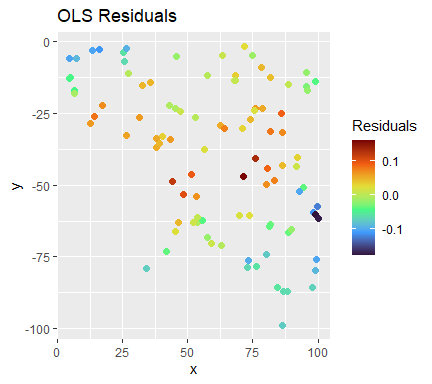<!-- -->

``` r
# We can see spatial clustering in the residuals, indicating spatial autocorrelation
# We can also perform a Moran's I test to quantify this, but I will do that later

# Fit a variogram to the residuals
ols_variogram <- variogram(ols_resids ~ 1, data = df)

# Test different variogram models
exp_var <- fit.variogram(ols_variogram, model = vgm("Exp"))
sph_var <- fit.variogram(ols_variogram, model = vgm("Sph"))
gau_var <- fit.variogram(ols_variogram, model = vgm("Gau"))

# Plot the variograms
plot(ols_variogram, exp_var, main = "OLS Residuals Variogram (Exponential)")
```

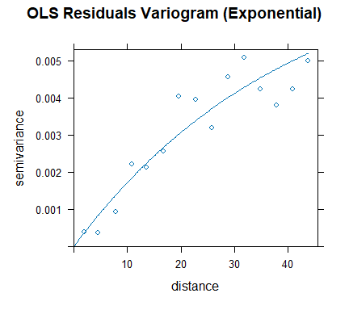<!-- -->

``` r
plot(ols_variogram, sph_var, main = "OLS Residuals Variogram (Spherical)")
```

<!-- -->

``` r
plot(ols_variogram, gau_var, main = "OLS Residuals Variogram (Gaussian)")
```

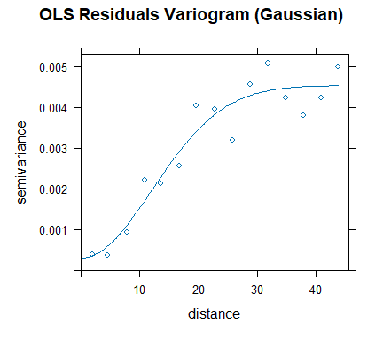<!-- -->

``` r
# Based on visual inspection, the models all seem to fit well
```

``` r
# We can fit GLS models using the variogram models and compare them based on AIC
# exp_model <- gls(f, correlation = corExp(form = ~ x + y), data = df) # False convergence error
sph_model <- gls(f, correlation = corSpher(form = ~ x + y), data = df)
gau_model <- gls(f, correlation = corGaus(form = ~ x + y), data = df)

# The AIC values are similar, but the best is the spherical model
AIC(sph_model, gau_model)
```

    ##           df       AIC
    ## sph_model  4 -410.0129
    ## gau_model  4 -324.4112

``` r
# We can plot the residuals of this model to confirm that they are now spatially uncorrelated
# Note: we most use type = "normalized" to get standardized residuals, otherwise the residuals will still show spatial autocorrelation
df$gls_resids <- residuals(sph_model, type = "normalized") 

plt_gls <-
  ggplot(df) +
  geom_point(aes(x = x, y = y, color = gls_resids), cex = 2) +
  scale_color_viridis_c(option = "turbo") +
  labs(title = "GLS Residuals", col = "Residuals")
plot_grid(plt_ols, plt_gls, nrow = 1)
```

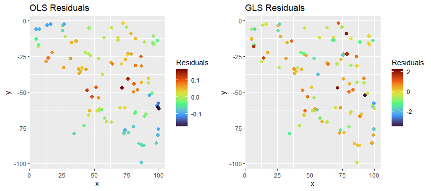<!-- -->

``` r
# We can see that the residuals are now spatially uncorrelated
```

A note about nuggets: By default, the GLS models do not fit a nugget
term. This means that they assume residuals at the same location are
perfectly correlated, which may not always be the case in real-world
data. If you suspect that there is unstructured microscale variance
(random noise at zero distance), you can include a nugget term in your
model by setting `nugget = TRUE` in the correlation structure. However,
this can absorb spatial signal and cause predictor effects to appear
insignificant. Because of this, I fit my models without a nugget term,
because I don’t expect to have much microscale variation in
heterozygosity.

``` r
no_nugget <- gls(f, correlation = corSpher(form = ~ x + y, nugget = FALSE), data = df)
nugget <- gls(f, correlation = corSpher(form = ~ x + y, nugget = TRUE), data = df)

# In this case, there is no major difference between the nugget vs no nugget models.
summary(no_nugget)
```

    ## Generalized least squares fit by REML
    ##   Model: f 
    ##   Data: df 
    ##         AIC       BIC   logLik
    ##   -410.0129 -399.6731 209.0065
    ## 
    ## Correlation Structure: Spherical spatial correlation
    ##  Formula: ~x + y 
    ##  Parameter estimate(s):
    ##    range 
    ## 91.81978 
    ## 
    ## Coefficients:
    ##                  Value  Std.Error  t-value p-value
    ## (Intercept) 0.06047140 0.04115635 1.469309  0.1450
    ## predictor   0.03725507 0.02136017 1.744138  0.0843
    ## 
    ##  Correlation: 
    ##           (Intr)
    ## predictor -0.102
    ## 
    ## Standardized residuals:
    ##         Min          Q1         Med          Q3         Max 
    ## -1.03064045  0.03085362  0.86751583  1.45249471  2.66013230 
    ## 
    ## Residual standard error: 0.08358645 
    ## Degrees of freedom: 100 total; 98 residual

``` r
summary(nugget)
```

    ## Generalized least squares fit by REML
    ##   Model: f 
    ##   Data: df 
    ##         AIC       BIC   logLik
    ##   -408.0129 -395.0881 209.0065
    ## 
    ## Correlation Structure: Spherical spatial correlation
    ##  Formula: ~x + y 
    ##  Parameter estimate(s):
    ##        range       nugget 
    ## 9.181975e+01 7.191357e-10 
    ## 
    ## Coefficients:
    ##                  Value  Std.Error  t-value p-value
    ## (Intercept) 0.06047143 0.04115634 1.469310  0.1450
    ## predictor   0.03725508 0.02136017 1.744138  0.0843
    ## 
    ##  Correlation: 
    ##           (Intr)
    ## predictor -0.102
    ## 
    ## Standardized residuals:
    ##         Min          Q1         Med          Q3         Max 
    ## -1.03064090  0.03085334  0.86751566  1.45249462  2.66013239 
    ## 
    ## Residual standard error: 0.08358644 
    ## Degrees of freedom: 100 total; 98 residual

``` r
AIC(no_nugget, nugget)
```

    ##           df       AIC
    ## no_nugget  4 -410.0129
    ## nugget     5 -408.0129

## 2.2 Option 2: Spatial error and lag models

Our second option for fitting a spatial model is to model spatial
dependence explicitly using spatial lag and spatial error models. These
models extend ordinary least squares (OLS) by incorporating spatial
relationships between observations, either in the response variable
(spatial lag; SLM) or in the error structure (spatial error; SEM). The
trickiest part of this approach is to create a spatial weights matrix
defining your neighborhoods. This can be done in a few different ways,
but the most common is to use k-nearest neighbors or distance-based
neighbors. Most tutorials on using SEM/SLM models use examples where the
data are adjacent polygons (e.g., counties or census tracts), which
makes neighbors more intuitive. In comparison, picking the right
approach for continuous data distributions is challenging; what I have
ended up doing is fitting a variogram to the residuals of an OLS model,
and then using the range of that variogram to create a distance-based
neighbor list.

<https://chrismgentry.github.io/Spatial-Regression/>

First, we construct our neighborhood weights matrix using the range from
the variogram we fit above:

``` r
# We have already fit a variogram above, so I am going to use those results and extract the range from the spherical model
vgm_range <- sph_var %>% filter(model == "Sph") %>% pull(range)

# The range is the distance at which the spatial autocorrelation between points becomes negligible. On a variogram, this is the distance where the variogram levels off.
print(vgm_range)
```

    ## [1] 38.46134

``` r
plot(ols_variogram, sph_var, main = "OLS Residuals Variogram (Spherical)") # Levels off around 40
```

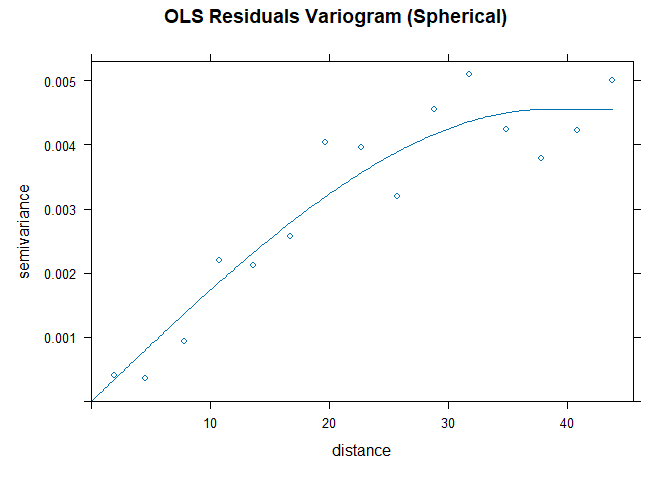<!-- -->

``` r
# Create a spatial weights matrix using the range from the variogram
nb <- dnearneigh(df, d1 = 0, d2 = vgm_range)
listw <- nb2listw(nb, style = "W", zero.policy = TRUE) # zero.policy = TRUE allows for zero weights, which is necessary if some points have no neighbors within the specified distance

# Plot the neighbors to visualize the spatial weights matrix
plot(nb, st_coordinates(df), main = paste0("Neighborhoods (Range = ", round(vgm_range, 2), ")"))
```

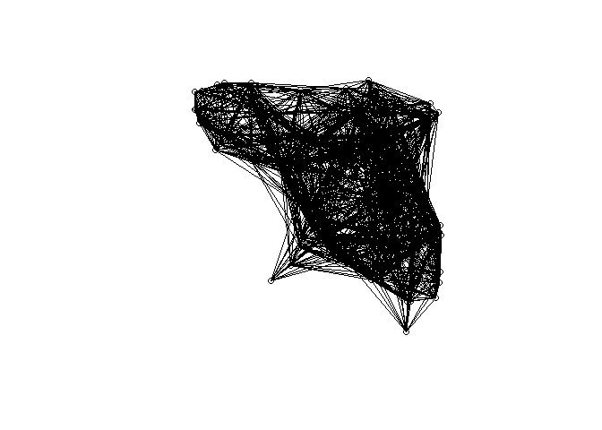<!-- -->

We can use this neighborhood weights matrix to perform Lagrange
Multiplier tests for spatial dependence:

| Test | Tests for | Null hypothesis |
|----|----|----|
| `SARMA` | Any spatial dependence (lag or error) | No spatial dependence |
| `RSlag` | Spatial lag dependence | No spatial lag dependence |
| `RSerr` | Spatial error dependence | No spatial error dependence |
| `adjRSlag` | Spatial lag dependence (robust to error) | No spatial lag dependence |
| `adjRSerr` | Spatial error dependence (robust to lag) | No spatial error dependence |

``` r
# Run the tests for spatial dependence
lm.RStests(ols_model, listw, test = "all")
```

    ## 
    ##  Rao's score (a.k.a Lagrange multiplier) diagnostics for spatial
    ##  dependence
    ## 
    ## data:  
    ## model: lm(formula = f, data = df)
    ## test weights: listw
    ## 
    ## RSerr = 81.376, df = 1, p-value < 2.2e-16
    ## 
    ## 
    ##  Rao's score (a.k.a Lagrange multiplier) diagnostics for spatial
    ##  dependence
    ## 
    ## data:  
    ## model: lm(formula = f, data = df)
    ## test weights: listw
    ## 
    ## RSlag = 72.908, df = 1, p-value < 2.2e-16
    ## 
    ## 
    ##  Rao's score (a.k.a Lagrange multiplier) diagnostics for spatial
    ##  dependence
    ## 
    ## data:  
    ## model: lm(formula = f, data = df)
    ## test weights: listw
    ## 
    ## adjRSerr = 10.542, df = 1, p-value = 0.001167
    ## 
    ## 
    ##  Rao's score (a.k.a Lagrange multiplier) diagnostics for spatial
    ##  dependence
    ## 
    ## data:  
    ## model: lm(formula = f, data = df)
    ## test weights: listw
    ## 
    ## adjRSlag = 2.0745, df = 1, p-value = 0.1498
    ## 
    ## 
    ##  Rao's score (a.k.a Lagrange multiplier) diagnostics for spatial
    ##  dependence
    ## 
    ## data:  
    ## model: lm(formula = f, data = df)
    ## test weights: listw
    ## 
    ## SARMA = 83.45, df = 2, p-value < 2.2e-16

``` r
# Results:
# SARMA = 84.627, df = 2, p-value < 2.2e-16
# adjRSlag = 2.0598, df = 1, p-value = 0.1512
# adjRSerr = 11.149, df = 1, p-value = 0.0008408
# RSlag = 73.479, df = 1, p-value < 2.2e-16
# RSerr = 82.568, df = 1, p-value < 2.2e-16
```

Based on these results, we should probably fit a Spatial Error Model
(SEM) because we have significant adjRSerr, but non-significant adjRSlag
(i.e., no strong evidence for lag dependence when adjusting for error
dependence.)

``` r
# Fit an SEM model
sem_model <- errorsarlm(f, data = df, listw = listw, zero.policy = TRUE)
summary(sem_model)
```

    ## 
    ## Call:errorsarlm(formula = f, data = df, listw = listw, zero.policy = TRUE)
    ## 
    ## Residuals:
    ##       Min        1Q    Median        3Q       Max 
    ## -0.149167 -0.034257 -0.002278  0.040885  0.153990 
    ## 
    ## Type: error 
    ## Coefficients: (asymptotic standard errors) 
    ##             Estimate Std. Error z value  Pr(>|z|)
    ## (Intercept) 0.030131   0.058519  0.5149 0.6066287
    ## predictor   0.110882   0.032055  3.4592 0.0005419
    ## 
    ## Lambda: 0.90277, LR test value: 27.372, p-value: 1.6785e-07
    ## Asymptotic standard error: 0.064612
    ##     z-value: 13.972, p-value: < 2.22e-16
    ## Wald statistic: 195.22, p-value: < 2.22e-16
    ## 
    ## Log likelihood: 142.9278 for error model
    ## ML residual variance (sigma squared): 0.0031922, (sigma: 0.056499)
    ## Number of observations: 100 
    ## Number of parameters estimated: 4 
    ## AIC: -277.86, (AIC for lm: -252.48)

``` r
# We can also fit an SLM model, for comparison
slm_model <- lagsarlm(f, data = df, listw = listw, zero.policy = TRUE)
summary(slm_model)
```

    ## 
    ## Call:lagsarlm(formula = f, data = df, listw = listw, zero.policy = TRUE)
    ## 
    ## Residuals:
    ##        Min         1Q     Median         3Q        Max 
    ## -0.1500407 -0.0357839 -0.0038155  0.0404794  0.1497203 
    ## 
    ## Type: lag 
    ## Coefficients: (asymptotic standard errors) 
    ##              Estimate Std. Error z value  Pr(>|z|)
    ## (Intercept) -0.022329   0.010594 -2.1078 0.0350473
    ## predictor    0.109718   0.030314  3.6194 0.0002953
    ## 
    ## Rho: 0.8937, LR test value: 28.453, p-value: 9.5992e-08
    ## Asymptotic standard error: 0.067783
    ##     z-value: 13.185, p-value: < 2.22e-16
    ## Wald statistic: 173.84, p-value: < 2.22e-16
    ## 
    ## Log likelihood: 143.4684 for lag model
    ## ML residual variance (sigma squared): 0.0031649, (sigma: 0.056257)
    ## Number of observations: 100 
    ## Number of parameters estimated: 4 
    ## AIC: -278.94, (AIC for lm: -252.48)
    ## LM test for residual autocorrelation
    ## test value: 6.6109, p-value: 0.010136

``` r
# Extract residuals
# Note: here we don't need to use type = "normalized" because the residuals are already standardized by the model
df$sem_resids <- residuals(sem_model)
df$slm_resids <- residuals(slm_model)
df$sem_resids <- df$Ho - fitted(sem_model)
```

    ## This method assumes the response is known - see manual page

``` r
df$slm_resids <- df$Ho - fitted(slm_model)
```

    ## This method assumes the response is known - see manual page

``` r
# We can compare the models based on AIC
AIC(ols_model, sem_model, slm_model)
```

    ##           df       AIC
    ## ols_model  3 -252.4837
    ## sem_model  4 -277.8556
    ## slm_model  4 -278.9368

``` r
# Both spatial models are better than OLS, but SEM is better than SLM

# We can also compare Moran's I of the residuals to confirm that the SEM model has reduced spatial autocorrelation
moran.test(df$ols_resids, listw, zero.policy = TRUE) # Moran's I = 0.21 (p < 2.2e-16)
```

    ## 
    ##  Moran I test under randomisation
    ## 
    ## data:  df$ols_resids  
    ## weights: listw    
    ## 
    ## Moran I statistic standard deviate = 11.926, p-value < 2.2e-16
    ## alternative hypothesis: greater
    ## sample estimates:
    ## Moran I statistic       Expectation          Variance 
    ##      0.2124991234     -0.0101010101      0.0003484126

``` r
moran.test(df$slm_resids, listw, zero.policy = TRUE) # Moran's I = 0.04 (p = 0.005)
```

    ## 
    ##  Moran I test under randomisation
    ## 
    ## data:  df$slm_resids  
    ## weights: listw    
    ## 
    ## Moran I statistic standard deviate = 2.541, p-value = 0.005526
    ## alternative hypothesis: greater
    ## sample estimates:
    ## Moran I statistic       Expectation          Variance 
    ##      0.0372736186     -0.0101010101      0.0003475939

``` r
moran.test(df$sem_resids, listw, zero.policy = TRUE) # Moran's I = 0.04 (p = 0.003)
```

    ## 
    ##  Moran I test under randomisation
    ## 
    ## data:  df$sem_resids  
    ## weights: listw    
    ## 
    ## Moran I statistic standard deviate = 2.6676, p-value = 0.003819
    ## alternative hypothesis: greater
    ## sample estimates:
    ## Moran I statistic       Expectation          Variance 
    ##      0.0396323818     -0.0101010101      0.0003475718

``` r
# Both spatial models reduce Moran's I in the residuals, in comparison to the OLS model

# We can plot the residuals of the SEM model to confirm that they are now spatially uncorrelated
plt_sem <- 
  ggplot(df) +
  geom_point(aes(x = x, y = y, color = sem_resids), cex = 2) +
  scale_color_viridis_c(option = "turbo") +
  labs(title = "SEM Residuals", col = "Residuals")

plt_slm <-
  ggplot(df) +
  geom_point(aes(x = x, y = y, color = slm_resids), cex = 2) +
  scale_color_viridis_c(option = "turbo") +
  labs(title = "SLM Residuals", col = "Residuals") 

plot_grid(plt_ols, plt_sem, plt_slm, nrow = 1)
```

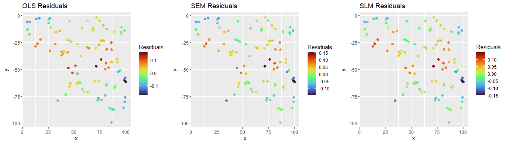<!-- -->

``` r
# The SLM/SEM residuals still show spatial autocorrelation
```

We can then compare our SEM/SLM models with the GLS model:

``` r
# You will get a warning that the models are not all fitted to the same number of observations, but I believe this is just an artifact of the different ways the models are fit
AIC(ols_model, sph_model, sem_model, slm_model)
```

    ## Warning in AIC.default(ols_model, sph_model, sem_model, slm_model): models are
    ## not all fitted to the same number of observations

    ##           df       AIC
    ## ols_model  3 -252.4837
    ## sph_model  4 -410.0129
    ## sem_model  4 -277.8556
    ## slm_model  4 -278.9368

``` r
# The spherical model is the best fit here

# We can plot the residuals and confirm
plot_grid(plt_ols, plt_gls, plt_sem, plt_slm, nrow = 1)
```

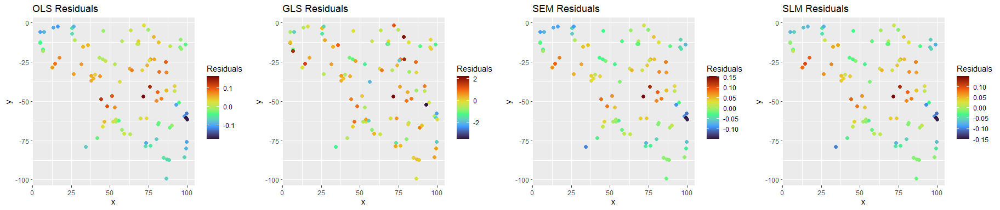<!-- -->

In this example, the spherical GLS model is the best fit, but I have
also had cases where the SEM/SLM models are better. It really depends on
the data and the spatial structure of the residuals. In this example,
there is only one driver of genetic diversity, the habitat
suitability/connectivity layer (i.e., `lotr_lyr`), so our predictor is
the only variable that is driving genetic diversity.

# 3. Plot results

## 3.1 Predicted vs. observed plots

The first plot I like to make is a scatterplot of the predicted values
vs. the observed values. This helps us see how well the model fits the
data and whether there are any patterns in the residuals.

Below we plot the predicted values from the GLS model against the
observed heterozygosity values.

``` r
df$gls_predict <- predict(sph_model)

ggplot(df, aes(x = gls_predict, y = Ho)) +
  geom_point() +
  geom_smooth(method = "lm") +
  labs(x = "Predicted Heterozygosity", y = "Observed Heterozygosity") +
  theme_classic() +
  stat_cor()
```

    ## `geom_smooth()` using formula = 'y ~ x'

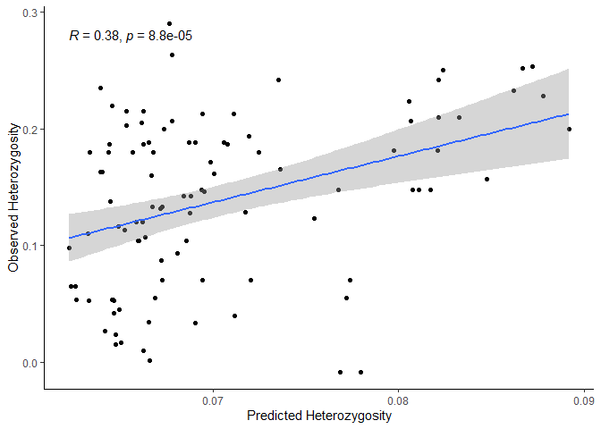<!-- -->

If we do the same thing for the SEM model, we see that the plot of
observed versus predicted values is quite different.

``` r
df$sem_predict <- predict(sem_model) %>% data.frame() %>% pull(fit)
```

    ## This method assumes the response is known - see manual page

``` r
ggplot(df, aes(x = sem_predict, y = Ho)) +
  geom_point() +
  geom_smooth(method = "lm") +
  labs(x = "Predicted Heterozygosity", y = "Observed Heterozygosity") +
  theme_classic() +
  stat_cor()
```

    ## `geom_smooth()` using formula = 'y ~ x'

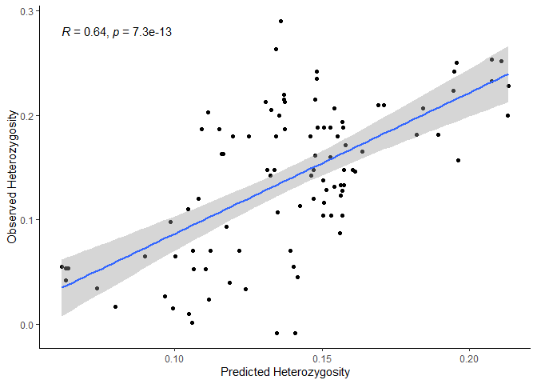<!-- -->

This is because, in the GLS model, predictions are based only on the
fixed effects (spatial autocorrelation is used to estimate the
coefficients but not to generate predictions). In contrast, the SEM
model incorporates the spatial effect into its predictions, so the
predicted values account for the neighboring structure.

If you plot the predicted values for the SEM model from the original
data (i.e, treat the original data like it is “new” data), then you will
see the predictions are similar to the GLS model because it excludes the
spatially structured error term and only uses the fixed effects.

``` r
df$sem_predict_new <- predict(sem_model, newdata = df) %>% data.frame() %>% pull(fit)

ggplot(df, aes(x = sem_predict_new, y = Ho)) +
  geom_point() +
  geom_smooth(method = "lm") +
  labs(x = "Predicted Heterozygosity", y = "Observed Heterozygosity") +
  theme_classic() +
  stat_cor()
```

    ## `geom_smooth()` using formula = 'y ~ x'

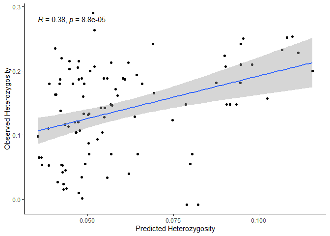<!-- -->

In terms of which predicted versus observed plot is better for the SEM
model, it depends on the goal: if you want to assess the in-sample fit,
use the first `predict()` values because they include the spatial error
component; if you want to evaluate the model’s predictive performance on
new data, use the `predict(newdata)` predicted values since they exclude
the spatial error and reflect how the model generalizes.

## 3.2 Predictor plots

We can plot the predictor against the response variable to see how well
each predictor explains the variation in the response.

``` r
ggplot(df, aes(x = predictor, y = Ho)) +
  geom_point() +
  geom_smooth(method = "lm") +
  labs(x = "Predictor", y = "Observed Heterozygosity") +
  theme_classic() +
  stat_cor()
```

    ## `geom_smooth()` using formula = 'y ~ x'

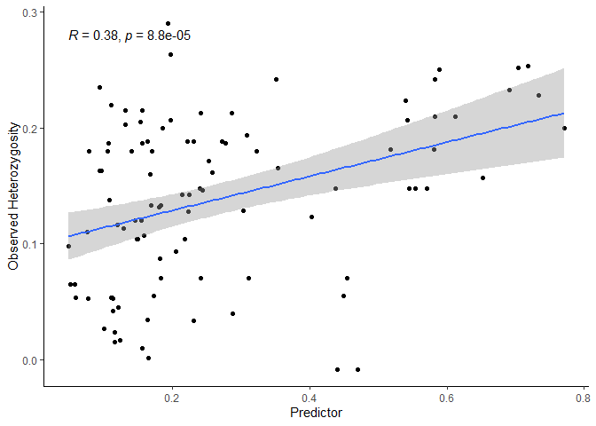<!-- -->

The problem with this plot is that it does not account for the spatial
autocorrelation in the data, so it may overestimate the strength of the
relationship between the predictor and the response.

If you have multiple predictors, you can use component-plus-residual
(C+R) plots, also known as partial residual plots, to visualize the
marginal relationship between each predictor and the response variable
while controlling for the other predictors. These plots work by adding
the estimated contribution of a predictor back to the model residuals,
allowing you to see the predictor’s effect after adjusting for the
effects of all other variables.

Note: As far as I am aware, you should not use partial regression plots
to assess spatial regression models. Partial regression plots show the
residuals of the response variable regressed on all other predictors
plotted against the residuals of the predictor regressed on the other
predictors. These plots are made for OLS models where the residuals are
assumed to be independent.

Other resources:

- <https://www.paulamoraga.com/book-spatial/index.html>

- <https://chrismgentry.github.io/Spatial-Regression/#1_Introduction_to_Spatial_Regression>

- <https://bookdown.org/hhwagner1/LandGenCourse_book/>

*AI Acknowledgement: portions of this vignette include text and examples
generated with the assistance of ChatGPT (OpenAI)*
